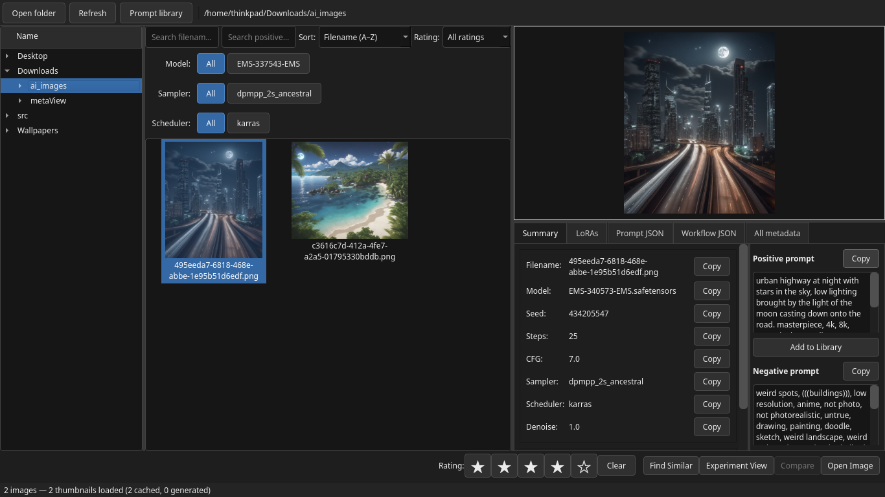

# metaView GenAI Image and Experiment Manager

**metaView** is a cross-platform desktop application for browsing AI-generated images, inspecting embedded generation metadata, comparing generations, organising prompts, and recording structured generation experiments.

It runs on Windows, macOS, and Linux. Pre-built applications are available from the GitHub **Releases** page.



## Highlights

### Browse and inspect

- Filesystem browser with a lazy-loaded thumbnail grid and responsive image display
- Search by filename and positive prompt
- Filter by model, sampler, scheduler, and star rating
- Sort and rate images without modifying the source files
- Live thumbnail updates when files are added to or removed from the current folder
- Hover tooltips showing model, sampler and steps, scheduler, resolution, and LoRAs

### Integrated Preview

- Double-click or press **Space** to open the integrated Preview window
- Smooth zooming, panning, fit-to-window, 100% view, and fullscreen mode
- Keyboard navigation through the current filtered image set
- Floating toolbar with automatic reveal and hide behaviour
- External system image viewer remains available through **Image → Open Image**

### Compare and analyse

- Side-by-side A/B image comparison
- Highlighted differences in model, sampler, scheduler, seed, resolution, prompts, and LoRAs
- Similarity Search using any combination of model, LoRAs, seed, prompt, sampler, scheduler, and resolution
- Experiment View for quickly reviewing images that share the same positive prompt

### Experiment Notebook

- Persistent notebooks, experiments, runs, notes, and conclusions
- Create retrospective experiments from selected images
- Attach images to ordered experiment runs
- Compare selected A/B images inside a persistent experiment window
- Record run notes and overall conclusions
- Surface consistency warnings for prompts, models, resolutions, and incomplete metadata

### Prompt Library

- Save prompts independently of their source folders
- Add ratings, tags, and notes
- Search, filter, and sort saved prompts
- Display all indexed images that use an exact prompt

### Desktop integration

- Full File, Edit, Image, Experiment, View, and Help menus
- Open folders, copy paths or prompts, reveal files in Explorer/Finder/file managers, and move images to Trash
- Drag image workflow JSON to ComfyUI or a file manager
- Native builds for Windows, macOS, and Linux

## Themes

metaView includes a curated set of compact desktop themes:

- Catppuccin Macchiato *(default)*
- Nord
- Tokyo Night
- Gruvbox Dark
- Dracula
- Catppuccin Latte
- Gruvbox Light

The selected theme is applied immediately and remembered between sessions.

## Installation

### Pre-built applications

Download the archive for your operating system from the GitHub **Releases** page, extract it fully, and run metaView from the extracted folder.

### Run from source

metaView requires Python 3.11 or newer.

```bash
python -m venv .venv
source .venv/bin/activate       # Linux/macOS
# .venv\Scripts\activate        # Windows PowerShell

python -m pip install -r requirements.txt
python main.py
```

## Keyboard shortcuts

| Action | Shortcut |
|---|---|
| Preview selected image | `Space` |
| Previous / next image in Preview | `Left` / `Right` |
| First / last image in Preview | `Home` / `End` |
| Fit image in Preview | `F` |
| 100% zoom in Preview | `1` |
| Toggle Preview toolbar | `T` |
| Toggle fullscreen Preview | `F11` |
| Close Preview / leave fullscreen | `Esc` |

Additional shortcuts are displayed in the application menus and in **Help → Keyboard Shortcuts**.

## Privacy and stored data

metaView works locally. Image ratings, Prompt Library data, the image index, and Experiment Notebook records are stored in the operating system's application-data directory. Source images are not modified to store ratings or experiment records.

## Current status

Version 0.3.0 introduces the Experiment Notebook, integrated Preview, complete desktop menus, expanded thumbnail actions, selectable themes, and a substantial interface refinement. The application is under active development; bug reports and focused pull requests are welcome.

## Contributing

See [CONTRIBUTING.md](CONTRIBUTING.md).

## Licence

metaView is released under the [MIT License](LICENSE).
